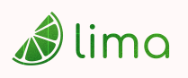

    

    <em>
        Asociación de estudiantes <b>LIMA</b> de la Universidad Autónoma de Madrid (UAM).
    </em>

---

Somos una agrupación de estudiantes de la UAM enfocada a promover el uso de tecnologías abiertas dentro del entorno académico y universitario.
Puedes encontrarnos en la escuela politécnica superior (EPS), o contactar con nosotros a través de nuestro correo.
